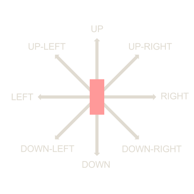
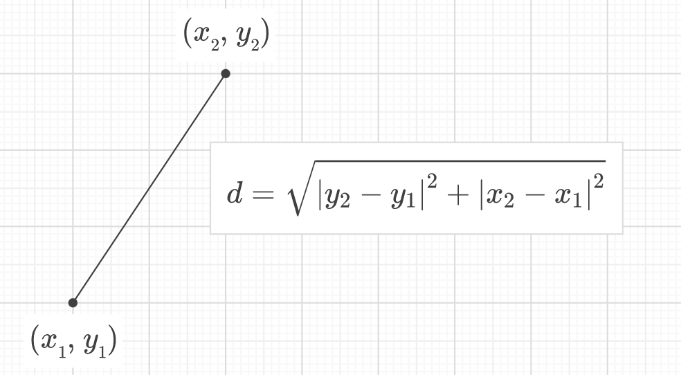
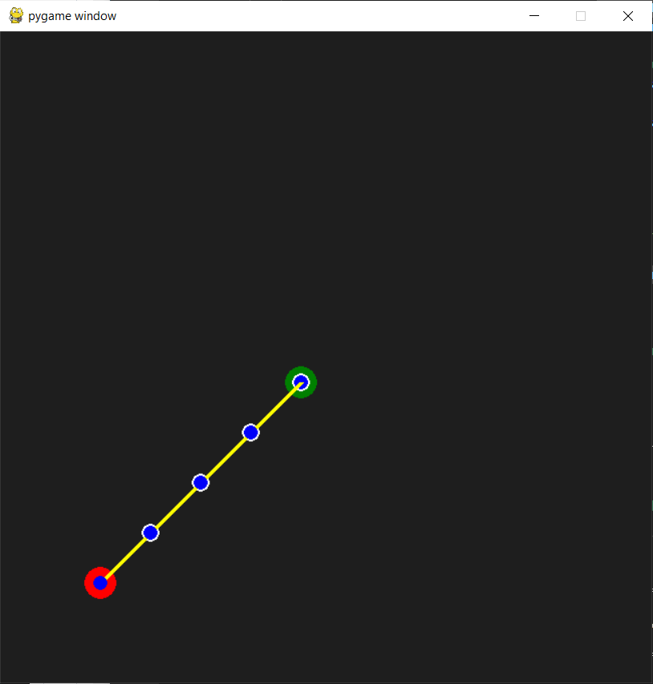
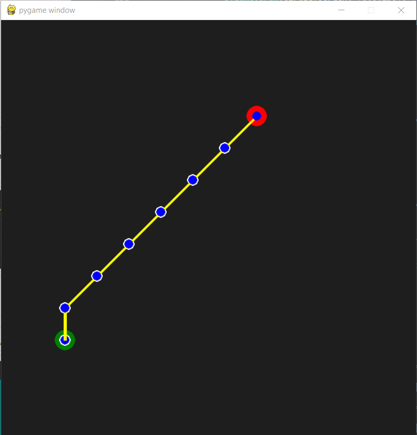
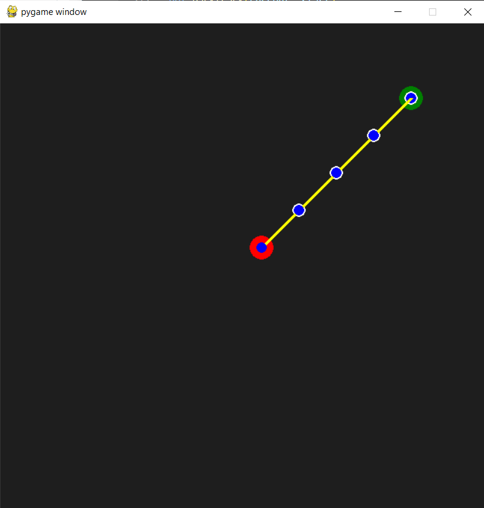
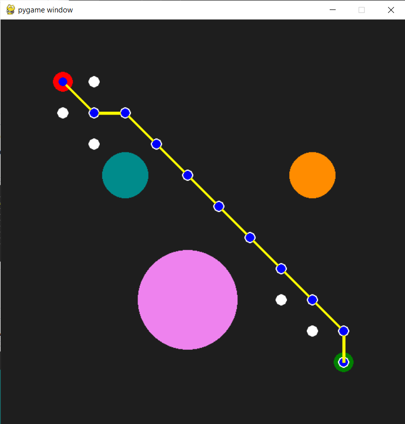
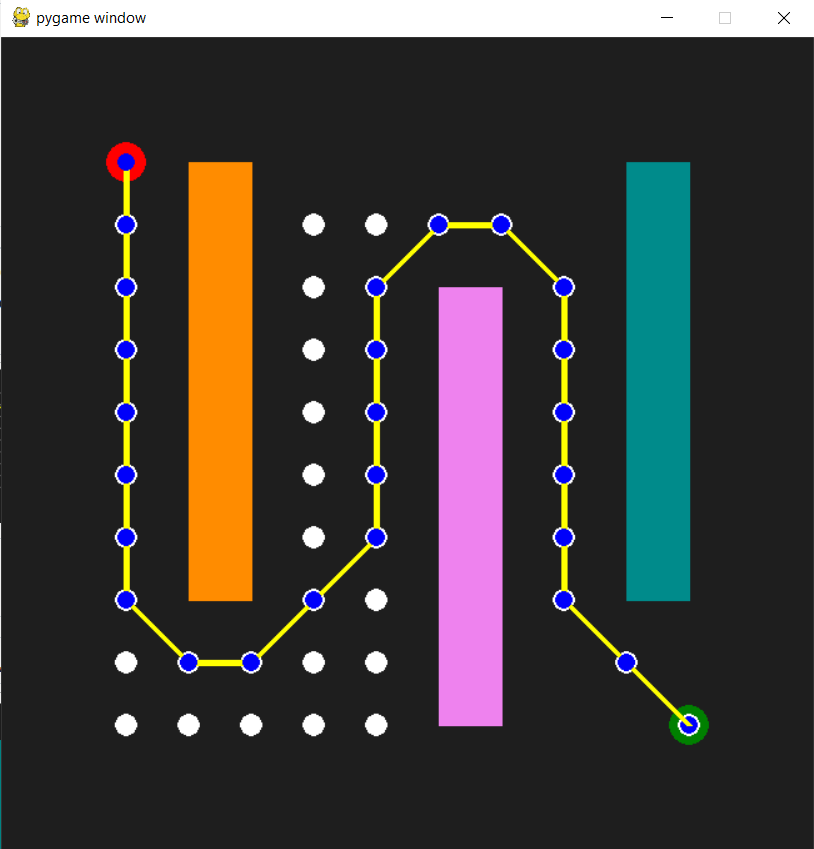
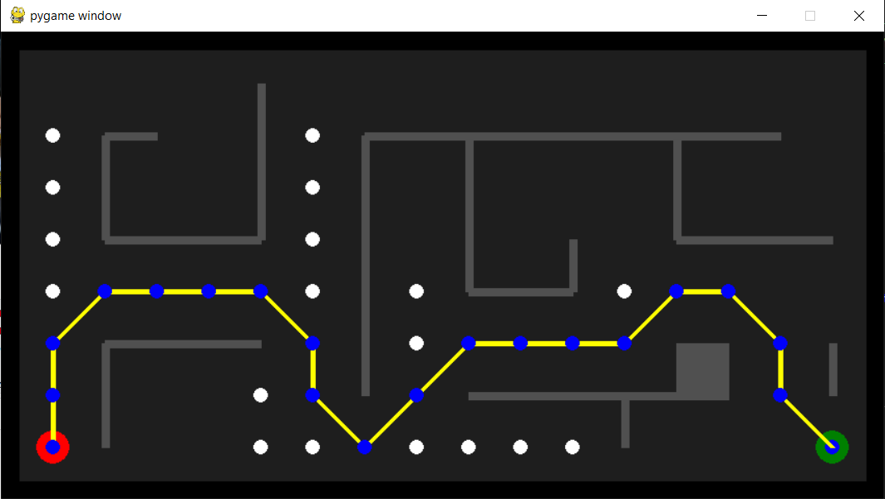

# A* Algorithm

### Task:

Implement A* algorithm on a map between a given start and goal node. The repository contains 3 files:

- **AStar_emptyMap.py** - The 10 x 10 map is empty. The script finds A* generated path between two nodes.
- **AStar_obsMap.py** - The 10 x 10 map has obstacles. The script finds the A* generated path between the two nodes while avoiding obstacle space. There algorithm can be implemented on two maps.  Set the variable 'mapNumber' to 1 or to 2 in the main function to switch between maps.
- **AStar_Maze.py** - Maze Map of size 16 x 8. The script finds A* generated path between two nodes.
        
### Path is visualized using pygame. 
- Start Node is Red
- Goal Node is Green
- Solution Path is in Blue/Yellow
- Explored Nodes are in White

### 8 action steps. Search Sequence: 

        Up --> UpRight --> Right --> DownRight --> Down --> DownLeft --> Left --> UpLeft

        

### Evaluation Function

The evaluation function $f(n)$ for A* algorithm is: $$ f(n) = g(n) + h(n) $$.

Here, $g(n)$ is the operating cost function and $h(n)$ is the heurisitc function. In the queue, the node with the smallest $f(n)$ value is explored first. Using a good heuristic is important in optimizing the performance of A*. I calculate the Euclidean Distance between the node and the goal:  

        

 
## Empty Map Results 

Start Node:(1,1) --> Goal Node:(5,5) |  Start Node:(7,9) --> Goal Node:(1,2)| Start Node:(6,6) --> Goal Node:(10,10)
:-------------------------:|:-------------------------:|:-------------------------:
  |  | 

## Obstacle Map Results 

Map 1: (1,10) --> (10,1)   |  Map 2: (1,10) --> (10,1) 
:-------------------------:|:-------------------------:
  |  

## Maze Map Results

        Start Node:(1,1) --> Goal Node:(16,1)

       

## License
[MIT](https://choosealicense.com/licenses/mit/)

## Acknowledgements

 - [101 Computing - A* Search Algorithm](https://www.101computing.net/a-star-search-algorithm/)
 - [Brilliant - A* Search](https://brilliant.org/wiki/a-star-search/)
 - [Planning Algorithms, LaValle, Chapter 2](http://lavalle.pl/planning/ch2.pdf)
 
## Support
For any questions, email me at jaisharm@umd.edu
